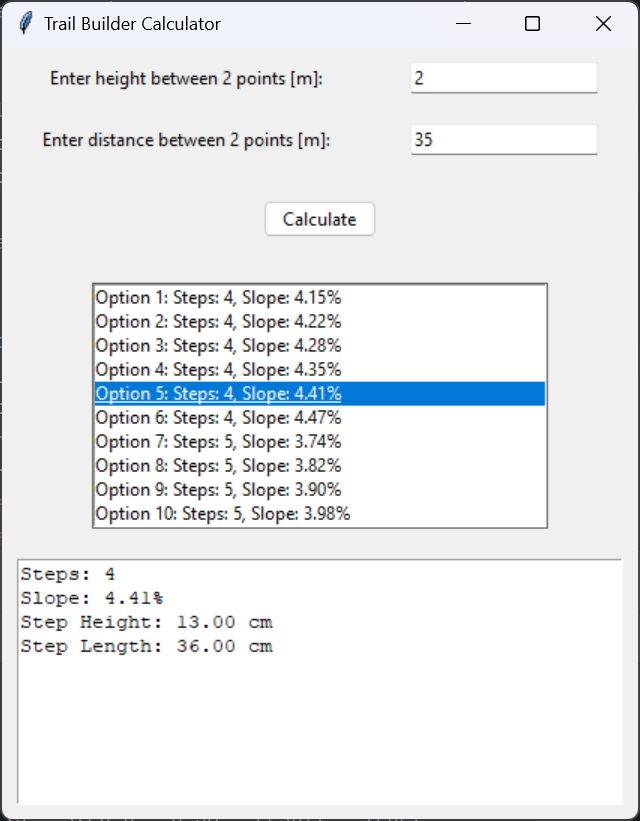

# stepsCalculator

A Python-based calculator for designing stairs according to Israeli building standards. Input the height and distance between two points, and the program outputs the optimal number, size, and dimensions of steps for construction.

⚠ Note: This program is still under development, so expect some bugs – I'm actively working to fix them. ⚠

The calculator adheres to the Israeli standards for stairs, which include:

Podium height (H): 0.026 meters
Podium length (L): 1.3 meters
Maximum slope: 4.5% (future updates will support higher slopes)
Minimum: 3 steps
The calculator provides all possible results, with or without podiums – it's up to you to decide how to proceed.

I'm open to suggestions for improvement – feel free to share your ideas!
